# שלב ד – תכנות (PL/pgSQL)

## הקדמה

בשלב זה כתבנו תוכניות PL/pgSQL על בסיס הנתונים של מערכת **MedFlow**.  
הקוד מתבסס על הסכימה והטבלאות שמופיעות ב־`step C/Backup_stage_3.sql` (כולל אינטגרציה עם `partner_data` באמצעות FDW).

## קבצי השלב

- **פונקציות**: `functions/` (2 פונקציות)
- **פרוצדורות**: `procedures/` (2 פרוצדורות)
- **טריגרים**: `triggers/` (2 טריגרים, לפחות אחד על UPDATE)
- **תוכניות ראשיות (Main)**: `mains/` (2 קבצים, כל אחד מזמן פונקציה אחת + פרוצדורה אחת)
- **Alter Table**: `AlterTable.sql` (בשלב זה לא נדרשו שינויים בטבלאות)

## תיקיית תמונות לדו"ח

לצורך הוכחות (Screenshots) יש להוסיף תמונות לתיקייה:

`Step D/screenshots/`

וב־README הזה מופיעים קישורים/מקומות מוכנים לתמונות. בכל מקום שמופיע `TODO` יש להחליף בשם הקובץ האמיתי של התמונה.

## סדר הרצה מומלץ

1. הרצת פונקציות: `functions/*.sql`
2. הרצת פרוצדורות: `procedures/*.sql`
3. הרצת טריגרים: `triggers/*.sql`
4. הרצת תוכניות ראשיות (להוכחות): `mains/*.sql`

> הערה: חלק מהאינטגרציה משתמש ב־Foreign Tables בסכמה `partner_data` (FDW). אם בסביבה שלך עדכונים על FDW חסומים/אין הרשאות, הפרוצדורה `sp_update_integration_notes_for_specialization` עלולה להיכשל — יש לצלם גם את הודעת השגיאה/החריגה כהוכחה או להריץ עם הרשאות מתאימות.

---

## פונקציה 1: `fn_patient_admissions_refcursor`

**תיאור מילולי:**  
הפונקציה מחזירה `refcursor` המכיל את כל רשומות האשפוז (`admission`) של מטופל מסוים לפי `patient_id`, ממויין מהחדש לישן.  
אם המטופל לא קיים — נזרקת חריגה (Exception).

**קוד:**

```sql
-- File: Step D/functions/fn_patient_admissions_refcursor.sql
CREATE OR REPLACE FUNCTION public.fn_patient_admissions_refcursor(p_patient_id numeric)
RETURNS refcursor
LANGUAGE plpgsql
AS $$
DECLARE
  c refcursor;
  v_exists boolean;
BEGIN
  SELECT EXISTS (
    SELECT 1
    FROM public.patient p
    WHERE p.patient_id = p_patient_id
  ) INTO v_exists;

  IF NOT v_exists THEN
    RAISE EXCEPTION 'Patient % does not exist', p_patient_id
      USING ERRCODE = 'P0001';
  END IF;

  OPEN c FOR
    SELECT
      a.admission_id,
      a.admission_date,
      a.discharge_date,
      a.admission_type,
      a.reason,
      a.patient_id
    FROM public.admission a
    WHERE a.patient_id = p_patient_id
    ORDER BY a.admission_date DESC, a.admission_id DESC;

  RETURN c;
END;
$$;
```

**הוכחה שהפונקציה עבדה (צילום מסך):**
- צילום מסך של הרצה שמחזירה תוצאות (כולל `FETCH` מה‑cursor)

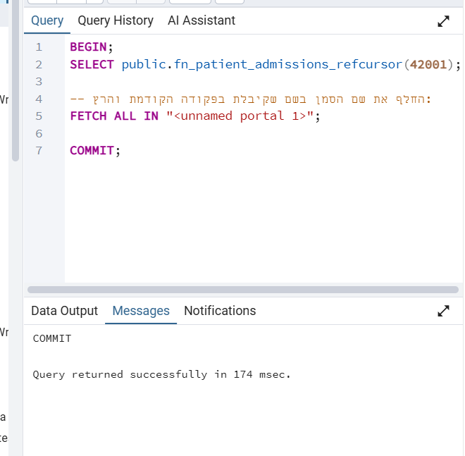
- צילום מסך של חריגה (ניסיון להריץ עם `patient_id` שלא קיים)

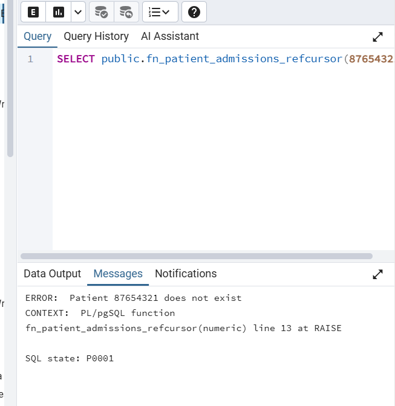

---

## פונקציה 2: `fn_patient_risk_score`

**תיאור מילולי:**  
הפונקציה מחשבת ציון סיכון למטופל לפי:
- מספר אלרגיות `Severe` בטבלת `patient_allergy`
- האם יש אשפוז פתוח (`discharge_date IS NULL`) בטבלת `admission`
- האם קיימת מחלה כרונית (חיפוש `ILIKE '%chronic%'`) בטבלת `patient_medical_history`

אם המטופל לא קיים — נזרקת חריגה.

**קוד:**

```sql
-- File: Step D/functions/fn_patient_risk_score.sql
CREATE OR REPLACE FUNCTION public.fn_patient_risk_score(p_patient_id numeric)
RETURNS integer
LANGUAGE plpgsql
AS $$
DECLARE
  score integer := 0;
  severe_allergies_count integer := 0;
  has_open_admission boolean := false;
  rec record;
BEGIN
  IF NOT EXISTS (SELECT 1 FROM public.patient p WHERE p.patient_id = p_patient_id) THEN
    RAISE EXCEPTION 'Patient % does not exist', p_patient_id
      USING ERRCODE = 'P0001';
  END IF;

  SELECT COUNT(*)
  INTO severe_allergies_count
  FROM public.patient_allergy pa
  WHERE pa.patient_id = p_patient_id
    AND pa.severity = 'Severe';

  score := score + (severe_allergies_count * 10);

  SELECT EXISTS (
    SELECT 1
    FROM public.admission a
    WHERE a.patient_id = p_patient_id
      AND a.discharge_date IS NULL
  )
  INTO has_open_admission;

  IF has_open_admission THEN
    score := score + 15;
  END IF;

  FOR rec IN
    SELECT pmh.condition
    FROM public.patient_medical_history pmh
    WHERE pmh.patient_id = p_patient_id
  LOOP
    IF rec.condition ILIKE '%chronic%' THEN
      score := score + 20;
      EXIT;
    END IF;
  END LOOP;

  RETURN score;
EXCEPTION
  WHEN others THEN
    RAISE;
END;
$$;
```

**הוכחה שהפונקציה עבדה (צילום מסך):**

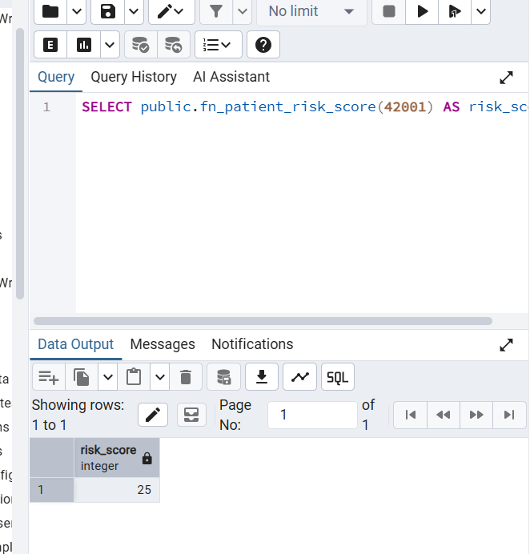

---

## פרוצדורה 1: `sp_close_long_open_admissions`

**תיאור מילולי:**  
הפרוצדורה סוגרת אשפוזים פתוחים ישנים:
- מאתרת אשפוזים עם `discharge_date IS NULL` ש‑`admission_date` שלהם ישן מ־`p_days` ימים.
- לכל אשפוז כזה מבצעת `UPDATE` לקביעת `discharge_date = CURRENT_DATE`.
- בנוסף, מעדכנת `notes` של אלרגיות חמורות (`Severe`) של אותו מטופל (DML נוסף).

אם לא נמצאו אשפוזים מתאימים — נזרקת חריגה.

**קוד:**

```sql
-- File: Step D/procedures/sp_close_long_open_admissions.sql
CREATE OR REPLACE PROCEDURE public.sp_close_long_open_admissions(p_days integer)
LANGUAGE plpgsql
AS $$
DECLARE
  cur_adm CURSOR FOR
    SELECT a.admission_id, a.patient_id, a.admission_date
    FROM public.admission a
    WHERE a.discharge_date IS NULL
      AND a.admission_date < (CURRENT_DATE - p_days)
    ORDER BY a.admission_date ASC, a.admission_id ASC;

  v_row record;
  v_closed_count integer := 0;
BEGIN
  IF p_days IS NULL OR p_days < 0 THEN
    RAISE EXCEPTION 'p_days must be a non-negative integer, got %', p_days
      USING ERRCODE = '22023';
  END IF;

  OPEN cur_adm;
  LOOP
    FETCH cur_adm INTO v_row;
    EXIT WHEN NOT FOUND;

    BEGIN
      UPDATE public.admission a
      SET discharge_date = CURRENT_DATE
      WHERE a.admission_id = v_row.admission_id
        AND a.discharge_date IS NULL;

      UPDATE public.patient_allergy pa
      SET notes = COALESCE(pa.notes, '') ||
                  CASE WHEN pa.notes IS NULL OR pa.notes = '' THEN '' ELSE ' | ' END ||
                  'Auto-note: admission closed by procedure on ' || CURRENT_DATE::text
      WHERE pa.patient_id = v_row.patient_id
        AND pa.severity = 'Severe';

      v_closed_count := v_closed_count + 1;
    EXCEPTION
      WHEN others THEN
        RAISE NOTICE 'Failed to close admission_id=% for patient_id=%: %',
          v_row.admission_id, v_row.patient_id, SQLERRM;
    END;
  END LOOP;
  CLOSE cur_adm;

  IF v_closed_count = 0 THEN
    RAISE EXCEPTION 'No open admissions older than % days were found', p_days
      USING ERRCODE = 'P0001';
  END IF;
END;
$$;
```

**הוכחה שהפרוצדורה עבדה (צילום מסך):**
- צילום “לפני” (SELECT שמראה אשפוזים פתוחים ישנים)

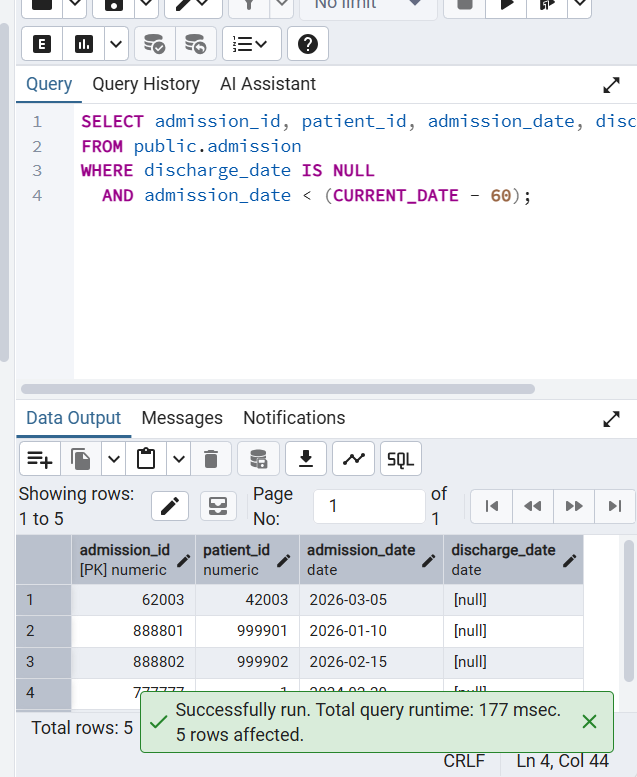

- צילום של הרצת `CALL ...`

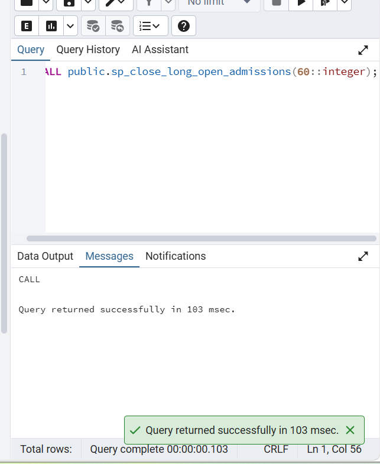

- צילום “אחרי” (SELECT שמראה ש־`discharge_date` התעדכן, וגם `patient_allergy.notes` עודכן)

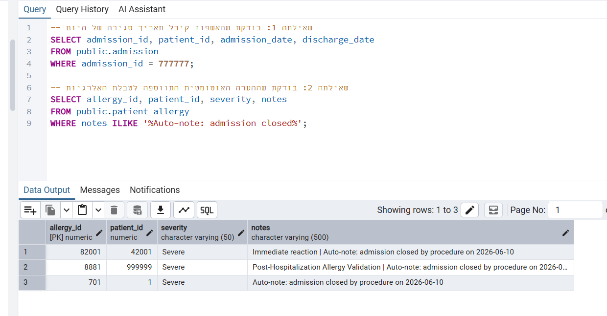

---

## פרוצדורה 2: `sp_update_integration_notes_for_specialization`

**תיאור מילולי:**  
הפרוצדורה מעדכנת את שדה `integration_notes` בטבלת המיפוי `partner_data.staff_integration_map` (Foreign Table) עבור רשומות ששייכות לרופאים מהאינטגרציה לפי התמחות (`specialization`).  
היא מבצעת JOIN בין `partner_data.staff_integration_map` ל־`partner_data.doctor` ומעדכנת `integration_notes`.

אם לא נמצאו רשומות — נזרקת חריגה.

**קוד:**

```sql
-- File: Step D/procedures/sp_update_integration_notes_for_specialization.sql
CREATE OR REPLACE PROCEDURE public.sp_update_integration_notes_for_specialization(p_specialization text)
LANGUAGE plpgsql
AS $$
DECLARE
  rec record;
  v_updated_count integer := 0;
BEGIN
  IF p_specialization IS NULL OR btrim(p_specialization) = '' THEN
    RAISE EXCEPTION 'p_specialization must be non-empty'
      USING ERRCODE = '22023';
  END IF;

  FOR rec IN
    SELECT
      m.my_staff_id,
      m.partner_staff_id,
      d.specialization
    FROM partner_data.staff_integration_map m
    JOIN partner_data.doctor d
      ON d.doctor_id = m.partner_staff_id
    WHERE d.specialization = p_specialization
  LOOP
    BEGIN
      UPDATE partner_data.staff_integration_map m2
      SET integration_notes =
        'Auto-updated on ' || CURRENT_DATE::text ||
        ' for specialization=' || p_specialization
      WHERE m2.my_staff_id = rec.my_staff_id
        AND m2.partner_staff_id = rec.partner_staff_id;

      IF FOUND THEN
        v_updated_count := v_updated_count + 1;
      END IF;
    EXCEPTION
      WHEN others THEN
        RAISE NOTICE 'Failed to update mapping my_staff_id=% partner_staff_id=%: %',
          rec.my_staff_id, rec.partner_staff_id, SQLERRM;
    END;
  END LOOP;

  IF v_updated_count = 0 THEN
    RAISE EXCEPTION 'No mappings found/updated for specialization=%', p_specialization
      USING ERRCODE = 'P0001';
  END IF;
END;
$$;
```

**הוכחה שהפרוצדורה עבדה (צילום מסך):**
- צילום “לפני” (SELECT על `partner_data.staff_integration_map` לרופאי Cardiology)

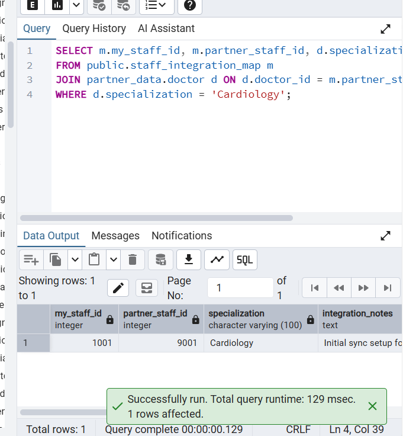

- צילום של `CALL public.sp_update_integration_notes_for_specialization('Cardiology');`

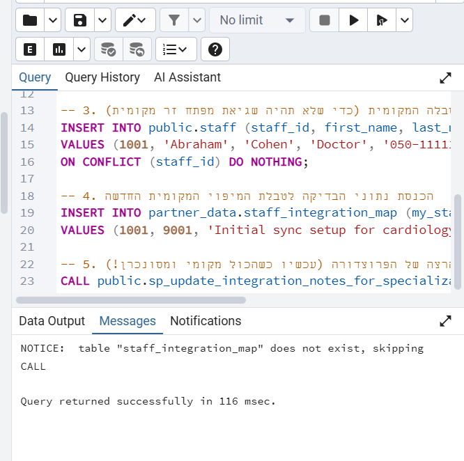

- צילום “אחרי” (SELECT שמראה ש־`integration_notes` השתנה)

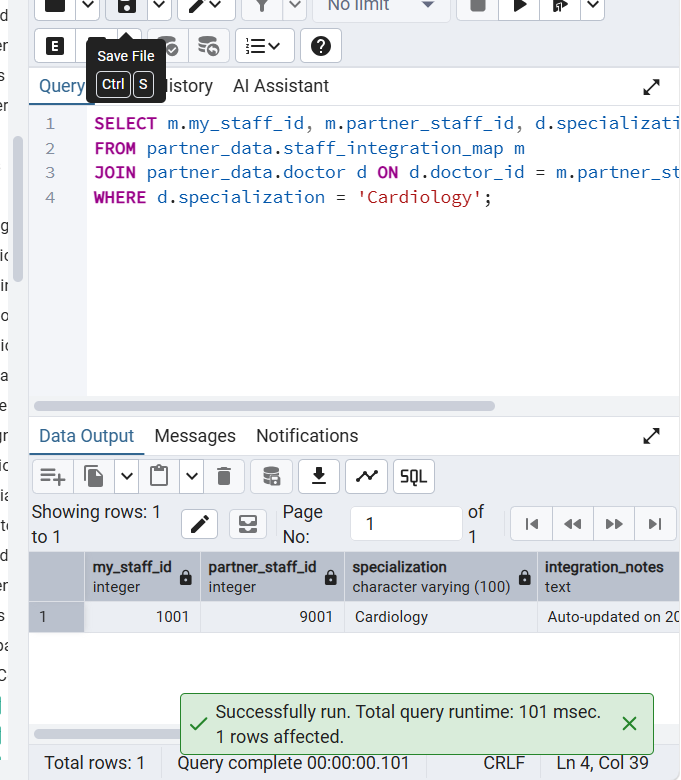

---

## טריגר 1 (UPDATE): `trg_patient_allergy_severe_after_update`

**תיאור מילולי:**  
טריגר זה מופעל **אחרי UPDATE בעמודה `severity`** בטבלת `patient_allergy`.  
כאשר חומרת האלרגיה משתנה ל־`Severe`:
- מתווסף טקסט ל־`patient_allergy.notes`
- מתבצע `INSERT` לטבלת `patient_medical_history` עם רשומה “Allergy Severity Alert”

**קוד:**

```sql
-- File: Step D/triggers/trg_patient_allergy_severe_after_update.sql
CREATE OR REPLACE FUNCTION public.trgfn_patient_allergy_severe_after_update()
RETURNS trigger
LANGUAGE plpgsql
AS $$
DECLARE
  v_new_history_id numeric;
BEGIN
  IF (TG_OP = 'UPDATE')
     AND (NEW.severity = 'Severe')
     AND (OLD.severity IS DISTINCT FROM NEW.severity) THEN

    UPDATE public.patient_allergy pa
    SET notes = COALESCE(pa.notes, '') ||
              CASE WHEN pa.notes IS NULL OR pa.notes = '' THEN '' ELSE ' | ' END ||
              'Severity changed to Severe on ' || CURRENT_DATE::text
    WHERE pa.allergy_id = NEW.allergy_id;

    SELECT COALESCE(MAX(history_id), 0) + 1
    INTO v_new_history_id
    FROM public.patient_medical_history;

    INSERT INTO public.patient_medical_history (history_id, condition, diagnosis_date, notes, patient_id)
    VALUES (
      v_new_history_id,
      'Allergy Severity Alert',
      CURRENT_DATE,
      'Auto-created by trigger (allergy_id=' || NEW.allergy_id::text || ')',
      NEW.patient_id
    );
  END IF;

  RETURN NEW;
EXCEPTION
  WHEN others THEN
    RAISE EXCEPTION 'Trigger failed on patient_allergy(allergy_id=%): %', NEW.allergy_id, SQLERRM
      USING ERRCODE = 'P0001';
END;
$$;

DROP TRIGGER IF EXISTS trg_patient_allergy_severe_after_update ON public.patient_allergy;

CREATE TRIGGER trg_patient_allergy_severe_after_update
AFTER UPDATE OF severity ON public.patient_allergy
FOR EACH ROW
EXECUTE FUNCTION public.trgfn_patient_allergy_severe_after_update();
```

**הוכחה שהטריגר עבד (צילום מסך):**
- צילום של UPDATE בטבלת `patient_allergy` שמשנה `severity` ל־`Severe`

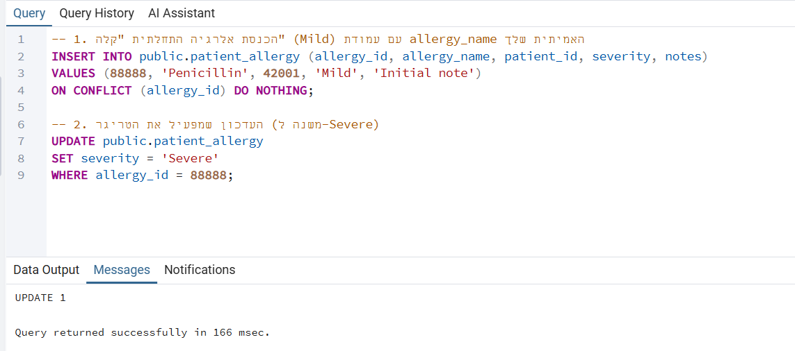

- צילום שמראה ש־`patient_allergy.notes` עודכן

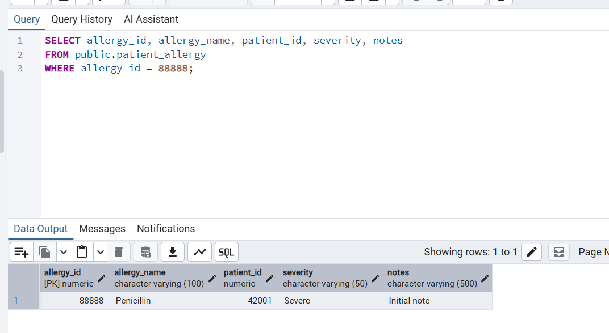

- צילום שמראה שנוספה שורה ב־`patient_medical_history`

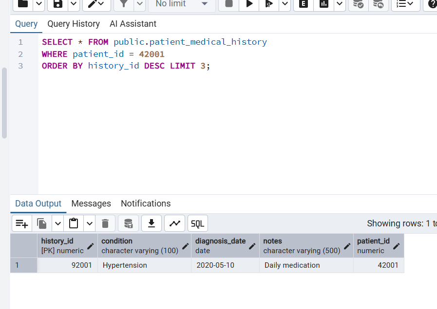

---

## טריגר 2: `trg_admission_validate_before_write`

**תיאור מילולי:**  
טריגר זה מופעל **לפני INSERT או UPDATE** בטבלת `admission` כדי לאכוף כללים עסקיים:
- אם `admission_type='Emergency'` אז חייב להיות `reason` לא ריק
- אם `discharge_date` קיים — הוא לא יכול להיות לפני `admission_date`

**קוד:**

```sql
-- File: Step D/triggers/trg_admission_validate_before_write.sql
CREATE OR REPLACE FUNCTION public.trgfn_admission_validate_before_write()
RETURNS trigger
LANGUAGE plpgsql
AS $$
BEGIN
  IF NEW.admission_type = 'Emergency' AND (NEW.reason IS NULL OR btrim(NEW.reason) = '') THEN
    RAISE EXCEPTION 'Emergency admission requires non-empty reason (admission_id=%)', NEW.admission_id
      USING ERRCODE = 'P0001';
  END IF;

  IF NEW.discharge_date IS NOT NULL AND NEW.discharge_date < NEW.admission_date THEN
    RAISE EXCEPTION 'discharge_date (%) cannot be before admission_date (%) for admission_id=%',
      NEW.discharge_date, NEW.admission_date, NEW.admission_id
      USING ERRCODE = '22007';
  END IF;

  RETURN NEW;
END;
$$;

DROP TRIGGER IF EXISTS trg_admission_validate_before_write ON public.admission;

CREATE TRIGGER trg_admission_validate_before_write
BEFORE INSERT OR UPDATE ON public.admission
FOR EACH ROW
EXECUTE FUNCTION public.trgfn_admission_validate_before_write();
```

**הוכחה שהטריגר עבד (צילום מסך):**
- צילום של ניסיון INSERT/UPDATE שמפר את הכללים ומציג חריגה

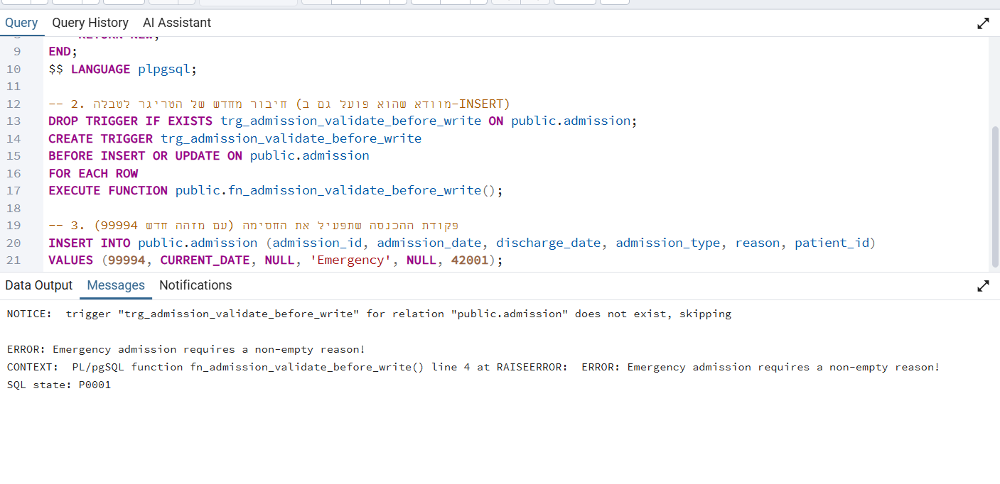

---

## תוכנית ראשית 1: `main_refcursor_and_close_admissions`

**תיאור מילולי:**  
תוכנית ראשית (בלוק `DO`) שמדגימה:
- זימון פונקציה שמחזירה `refcursor` (`fn_patient_admissions_refcursor`) והדפסה של התוצאות ב־`RAISE NOTICE`
- זימון פרוצדורה שסוגרת אשפוזים ישנים (`sp_close_long_open_admissions`)

**קוד:**

```sql
-- File: Step D/mains/main_refcursor_and_close_admissions.sql
DO $$
DECLARE
  p_id numeric := 42001;
  c refcursor;
  r record;
BEGIN
  c := public.fn_patient_admissions_refcursor(p_id);

  LOOP
    FETCH c INTO r;
    EXIT WHEN NOT FOUND;
    RAISE NOTICE 'admission_id=% admission_date=% discharge_date=% type=% reason=% patient_id=%',
      r.admission_id, r.admission_date, r.discharge_date, r.admission_type, r.reason, r.patient_id;
  END LOOP;
  CLOSE c;

  CALL public.sp_close_long_open_admissions(60);
END;
$$;
```

**הוכחה (צילום מסך):**
- צילום של הפלט (NOTICE) + הוכחת עדכון בדאטה אחרי הפרוצדורה

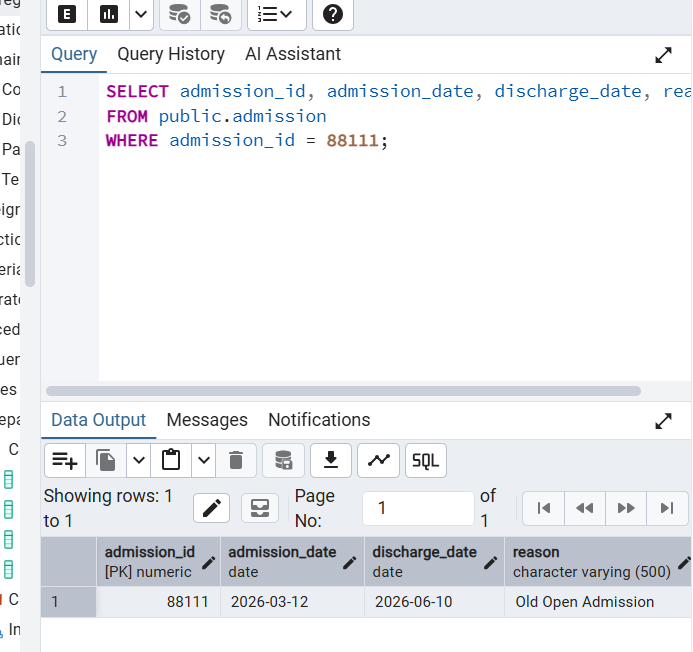

---

## תוכנית ראשית 2: `main_risk_and_integration`

**תיאור מילולי:**  
תוכנית ראשית (בלוק `DO`) שמדגימה:
- חישוב ציון סיכון (`fn_patient_risk_score`) והדפסה (`RAISE NOTICE`)
- עדכון הערות אינטגרציה לפי התמחות (`sp_update_integration_notes_for_specialization`)

**קוד:**

```sql
-- File: Step D/mains/main_risk_and_integration.sql
DO $$
DECLARE
  p_id numeric := 42001;
  v_score integer;
BEGIN
  v_score := public.fn_patient_risk_score(p_id);
  RAISE NOTICE 'Risk score for patient_id=% is %', p_id, v_score;

  CALL public.sp_update_integration_notes_for_specialization('Cardiology');
END;
$$;
```

**הוכחה (צילום מסך):**

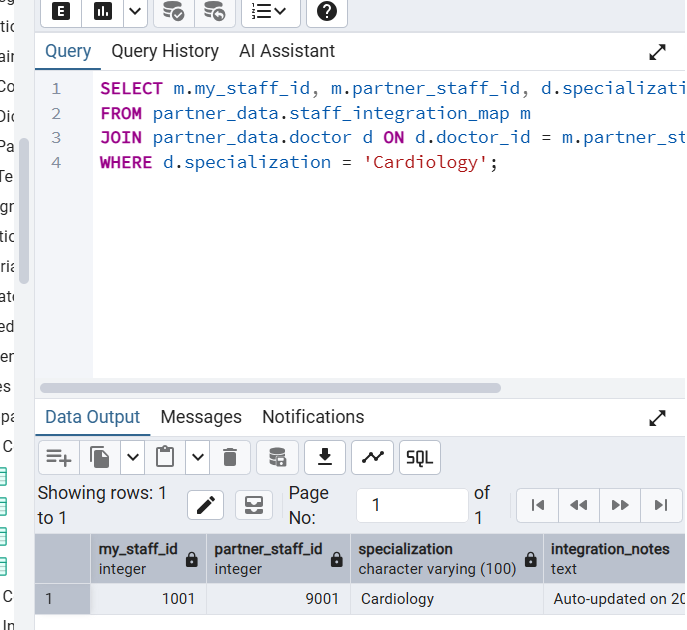


