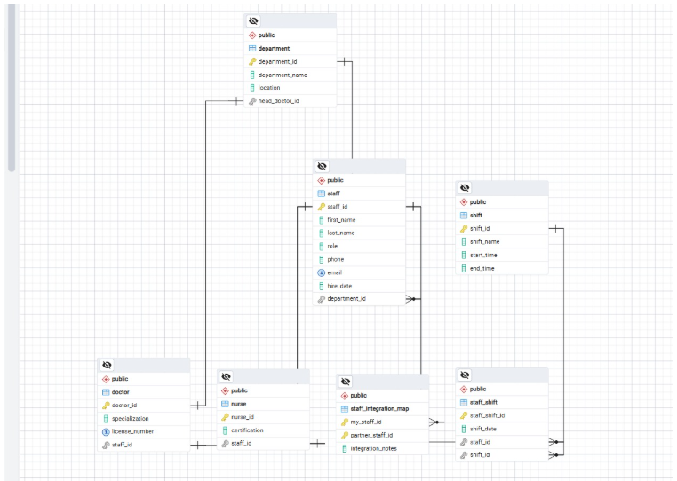

הDSD של האגף החדש: 


ה ERD של האגף החדש:




ה ERD משותף:

ה DSD לאחר אינטגרציה

# החלטות שנעשו בשלב האינטגרציה

## בחירת השיטה
בחרנו בשיטה ב' (Foreign Data Wrapper). החלטנו להשאיר את המערכות נפרדות ולבצע צימוד רך (Loose Coupling) כדי למנוע התנגשויות בשמות טבלאות (כמו staff או users) וכדי לשמור על עדכניות הנתונים בזמן אמת ללא צורך במיגרציה מסובכת.

## ניהול סכימות
הפרדנו את נתוני האגף החדש לסכימה ייעודית בשם partner_data כדי לשמור על סדר וארגון בבסיס הנתונים.

## מיפוי ישויות
הקמנו טבלת גישור (staff_integration_map) המקשרת בין המזהים הייחודיים של שני האגפים, מה שמאפשר לבצע Join בין המערכות בצורה יעילה.

# הסבר מילולי של התהליך והפקודות

## התקנה
הרצנו CREATE EXTENSION postgres_fdw כדי לאפשר תקשורת בין בסיסי נתונים.

## קישור שרת
הגדרנו SERVER המצביע על בסיס הנתונים של השותף וביצענו USER MAPPING לאבטחת הגישה.

## ייבוא אוטומטי
השתמשנו ב-IMPORT FOREIGN SCHEMA כדי למשוך את כל מבנה הטבלאות של השותף לסכימה המקומית שלנו באופן אוטומטי.


תמונה 2


## מבט 1 patient_admission_summary

תיאור מילולי:  
מבט זה מרכז את המידע על אשפוזי המטופלים במערכת. הוא מבצע חיבור (JOIN) בין טבלת המטופלים (PATIENT) לטבלת האשפוזים (ADMISSION) על בסיס קוד המטופל (patient_id). המבט מציג את השם המלא של המטופל (שילוב של שם פרטי ומשפחה), תאריך האשפוז, סוג האשפוז (חירום, אלקטיבי וכו') ואת סיבת האשפוז.

שליפת נתונים (SELECT *):


תמונה 3

## מבט 2 partner_clinic_view


תמונה 4


תיאור מילולי:  
מבט זה מציג את רשימת הרופאים והמחלקות שלהם מתוך המערכת החיצונית (האגף שקיבלנו מהפרטנר). המבט מבצע חיבור (JOIN) בין טבלת הרופאים לטבלת המחלקות בסכימה הזרָה partner_data. השתמשנו בעמודת הקישור staff_id מטבלת הרופאים ו-department_id מטבלת המחלקות כדי לאחד את הנתונים.

שליפת נתונים (SELECT *):


## יצירת קשר
הוספנו טבלת Mapping לקישור לוגי בין הישויות בשני האגפים.

# מבטים ושאילתות (Views & Queries)


תמונה 5

## מבט 3: integrated_patient_staff_view


תמונה 6


תיאור מילולי:  
מבט זה מהווה את לב האינטגרציה של הפרויקט. הוא משלב נתונים משלושה מקורות: טבלת המטופלים מהאגף המקומי (PATIENT), טבלת הרופאים מהאגף המרוחק (partner_data.doctor), וטבלת המיפוי המקשרת ביניהם (staff_integration_map). המבט מאפשר לראות איזה מטופל משויך לאיזה איש צוות חיצוני ומהן הערות הטיפול הרלוונטיות.

שליפת נתונים (SELECT *):


תמונה 7

# שאילתות על המבטים

## שאילתה 1 (על מבט 1):

תיאור מילולי:  
שליפת נתונים מרוכזת מהמבט patient_admission_summary, המאחד פרטי מטופלים, רופאים ומחלקות לישות אחת. 

קוד השאילתה: 

```sql
SELECT * FROM public.patient_admission_summary;
```

פלט:


תמונה 8


## שאילתה 2 (על מבט 1):

תיאור מילולי:  
שאילתה המבצעת אגרגציה (סיכום) של כמות האשפוזים במערכת, ממוינת לפי סוג האשפוז (למשל: דחוף, מתוכנן, ביקורת). 

קוד השאילתה: 

```sql
SELECT 
    admission_type, 
    COUNT(*) AS total_admissions
FROM public.patient_admission_summary
GROUP BY admission_type
ORDER BY total_admissions DESC;
```

פלט:


תמונה 9

## שאילתה 3 (על מבט 2):

תיאור מילולי:
שליפת כל הרופאים במערכת השותפה המומחים בתחום מסוים כדי לבדוק זמינות מומחים.

קוד השאילתה: 

```sql
SELECT doctor_id, department_name 
FROM public.partner_clinic_view 
WHERE specialization = 'Cardiology';
```

פלט:


תמונה 10


## שאילתה 4 (על מבט 2):

תיאור מילולי:
שאילתה המציגה את פריסת המחלקות והרופאים לפי מיקום גיאוגרפי במערכת השותפה.

קוד השאילתה: 

```sql
SELECT location, COUNT(doctor_id) AS total_doctors
FROM public.partner_clinic_view
GROUP BY location;
```

פלט:
```


תמונה 11


## שאילתה 5 (על מבט 3):

תיאור מילולי:
שאילתה זו נועדה לאחזר את שמות המטופלים מהמערכת המקומית המשויכים לאנשי צוות מהמערכת החיצונית (הפרטנר) שתחום התמחותם הוא קרדיולוגיה. השאילתה מציגה גם את "הערות האינטגרציה" שנרשמו בטבלת המיפוי, ובכך היא מאפשרת לצוות הרפואי לזהות במהירות אילו מטופלים נמצאים במעקב לבבי אצל השותף ומהו סטטוס הטיפול המשולב שלהם.

קוד השאילתה: 

```sql
SELECT patient_name, integration_notes 
FROM public.integrated_patient_staff_view 
WHERE partner_specialization = 'Cardiology';
```

פלט:
```


תמונה 12


## שאילתה 6 (על מבט 3):

תיאור מילולי: 
שאילתה זו מבצעת ניתוח כמותי של תהליך האינטגרציה על ידי ספירת מספר המטופלים המשויכים לכל רופא במערכת השותפה. באמצעות שימוש בפונקציית האגרגציה COUNT וקיבוץ לפי מזהה הרופא החיצוני (partner_doc_id), השאילתה מספקת תמונת מצב לגבי עומס העבודה המוטל על כל איש צוות חיצוני במסגרת שיתוף הפעולה בין האגפים.

קוד השאילתה: 

```sql
SELECT partner_doc_id, COUNT(patient_id) AS total_patients
FROM public.integrated_patient_staff_view
GROUP BY partner_doc_id;
```

פלט:
```


תבונה 13


# קבצי הפרויקט

-ה Integrate.sql: פקודות SQL ליצירת ה-Foreign Tables והגדרות השרת.
-ה Views.sql: קוד המקור ליצירת המבטים והשאילתות.
-ה backup3.sql: גיבוי מלא של המערכת המאוחדת.
```


## מבט 1 patient_admission_summary
